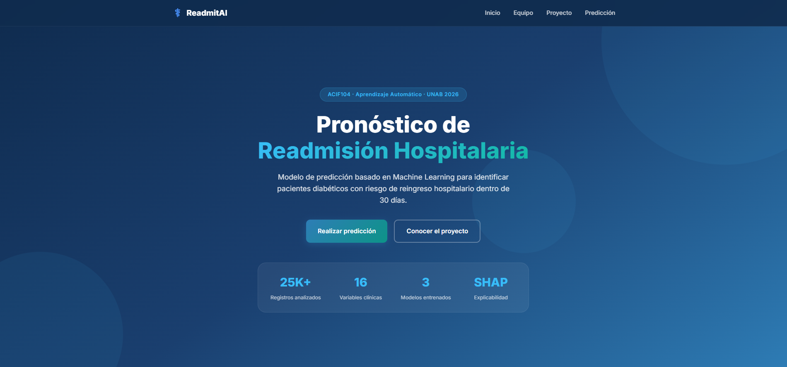
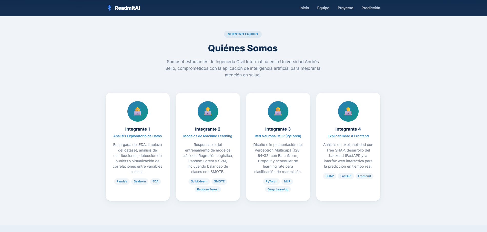
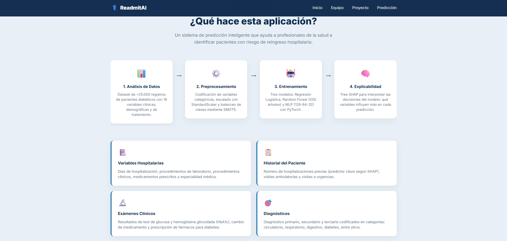
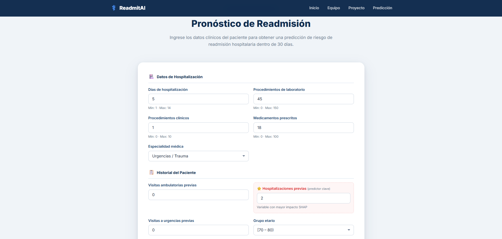
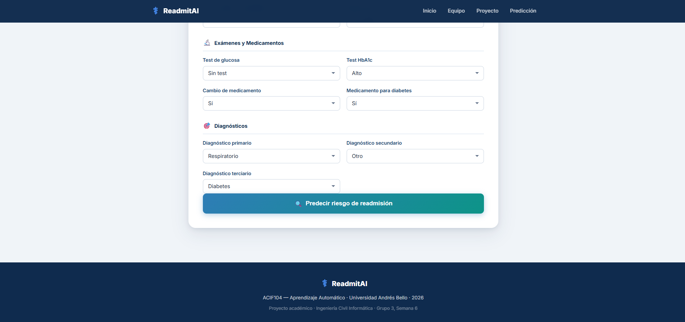

# ⚕️ ReadmitAI — Pronóstico de Readmisión Hospitalaria

Landing page del proyecto **ReadmitAI**, un sistema de predicción basado en Machine Learning para identificar pacientes diabéticos con riesgo de reingreso hospitalario dentro de 30 días.

> **ACIF104 · Aprendizaje Automático · Universidad Andrés Bello · 2026**  
> Ingeniería Civil Informática · Grupo 3, Semana 6

---

## 📋 Descripción

ReadmitAI es una aplicación web interactiva que permite a profesionales de la salud ingresar datos clínicos de un paciente y obtener una predicción de riesgo de readmisión hospitalaria. El sistema utiliza modelos de Machine Learning entrenados con un dataset de más de 25.000 registros de pacientes diabéticos y 16 variables clínicas.

### Características principales

- **Formulario interactivo** para ingreso de datos clínicos del paciente.
- **Predicción en tiempo real** mediante una API (FastAPI).
- **Explicabilidad con SHAP** para interpretar qué variables influyen más en cada predicción.
- **Diseño responsivo** adaptado a dispositivos móviles y escritorio.

---

## 🧠 Pipeline del Proyecto

| Etapa | Descripción |
|-------|-------------|
| 1. Análisis de Datos | Dataset de +25.000 registros con 16 variables clínicas, demográficas y de tratamiento |
| 2. Preprocesamiento | Codificación de variables categóricas, escalado con StandardScaler y balanceo con SMOTE |
| 3. Entrenamiento | Regresión Logística, Random Forest (200 árboles) y MLP [128-64-32] con PyTorch |
| 4. Explicabilidad | Tree SHAP para interpretar las decisiones del modelo |

---

## 👥 Equipo

| Integrante | Rol | Tecnologías |
|------------|-----|-------------|
| Integrante 1 | Análisis Exploratorio de Datos | Pandas, Seaborn, EDA |
| Integrante 2 | Modelos de Machine Learning | Scikit-learn, SMOTE, Random Forest |
| Integrante 3 | Red Neuronal MLP (PyTorch) | PyTorch, MLP, Deep Learning |
| Integrante 4 | Explicabilidad & Frontend | SHAP, FastAPI, Frontend |

---

## 🛠️ Tecnologías Utilizadas

- **Frontend:** HTML5, CSS3, JavaScript (Vanilla)
- **Backend:** FastAPI (Python)
- **ML/DL:** Scikit-learn, PyTorch, SMOTE
- **Explicabilidad:** SHAP (Tree SHAP)
- **Datos:** Pandas, Seaborn
- **Tipografía:** Google Fonts (Inter)

---

## 📂 Estructura de Archivos

```
Landingpage/
├── index.html       # Página principal
├── landing.css      # Estilos de la landing page
├── landing.js       # Lógica del formulario y conexión con la API
├── Capturas/        # Capturas de pantalla de la aplicación
│   ├── 1.png
│   ├── 2.png
│   ├── 3.png
│   ├── 4.png
│   └── 5.png
└── README.md        # Este archivo
```

---

## 📸 Capturas de Pantalla

### 1. Hero — Pantalla principal
Sección de bienvenida con el nombre del proyecto, descripción y estadísticas clave (25K+ registros, 16 variables, 3 modelos, SHAP).



---

### 2. Equipo — Quiénes Somos
Tarjetas con los 4 integrantes del equipo, sus roles y tecnologías asignadas.



---

### 3. Proyecto — Pipeline y Variables
Descripción del pipeline de ML (Análisis → Preprocesamiento → Entrenamiento → Explicabilidad) y las categorías de variables utilizadas.



---

### 4. Formulario de Predicción (parte superior)
Formulario interactivo para ingresar datos de hospitalización, historial del paciente, grupo etario y hospitalizaciones previas (predictor clave según SHAP).



---

### 5. Formulario de Predicción (parte inferior) y Footer
Sección de exámenes y medicamentos, diagnósticos, botón de predicción y pie de página del proyecto.



---

## 🚀 Uso

1. Abrir `index.html` en un navegador web.
2. Navegar por las secciones: Inicio, Equipo, Proyecto y Predicción.
3. En la sección **Predicción**, completar el formulario con los datos clínicos del paciente.
4. Presionar **"Predecir riesgo de readmisión"** para obtener el resultado.

> **Nota:** La predicción requiere que el backend (FastAPI) esté corriendo en `http://localhost:8000`.

---

## 📄 Licencia

Proyecto académico — Universidad Andrés Bello, 2026.
